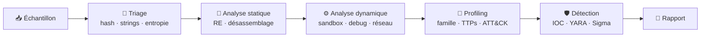

<!-- ===================== HEADER ===================== -->
<p align="center">
  
</p>

<p align="center">
  <a href="https://git.io/typing-svg">
    
  </a>
</p>

<p align="center">
  
  
  
  
</p>

---

## 🪖 À propos

```text
$ whoami
logicrazer

$ cat profile.txt
> Analyste malware : profiling, analyse statique et dynamique
> Je décortique les échantillons pour comprendre ce qu'ils font,
> comment ils le font, et comment les détecter.
```

Je travaille sur le **profiling de malware** : comprendre le comportement d'un échantillon, identifier sa famille, extraire ses indicateurs de compromission et produire des règles de détection exploitables par les équipes défensives.

---

## 🎯 Domaines d'expertise

<table>
  <tr>
    <td width="50%" valign="top">

### 🔬 Analyse statique
- Triage : hashes, entropie, strings, imports/exports
- Analyse de structure PE / ELF
- Détection de packers & obfuscation
- Désassemblage / décompilation
- Extraction de configuration

    </td>
    <td width="50%" valign="top">

### ⚙️ Analyse dynamique
- Exécution en sandbox isolée
- Analyse comportementale (fichiers, registre, processus)
- Analyse du trafic réseau & C2
- Debugging & unpacking manuel
- Analyse mémoire (dumps, injections)

    </td>
  </tr>
  <tr>
    <td width="50%" valign="top">

### 🧬 Profiling
- Classification par famille
- Mapping **MITRE ATT&CK**
- Persistance, évasion, mouvement latéral
- Corrélation d'échantillons

    </td>
    <td width="50%" valign="top">

### 🛡️ Détection
- Règles **YARA**
- Règles **Sigma**
- Extraction d'**IOC**
- Rapports d'analyse

    </td>
  </tr>
</table>

---

## 🧰 Arsenal

**Reverse engineering & analyse statique**


**Analyse dynamique & réseau**


**Environnements & scripting**


---

## 🔄 Méthodologie



---

## 📊 Stats GitHub

<p align="center">
  
  
</p>

---

## 📡 Contact

<p align="center">
  <a href="mailto:logicrazer@tutamail.com">
    
  </a>
  <a href="tel:+33757899112">
    
  </a>
</p>

---

## ⚠️ Avertissement

> Toutes mes analyses sont réalisées dans des **environnements isolés et contrôlés**, à des fins de **recherche, de défense et d'éducation**. Je ne publie aucun code malveillant fonctionnel et ne soutiens aucune utilisation offensive ou illégale.

<p align="center">
  
</p>
